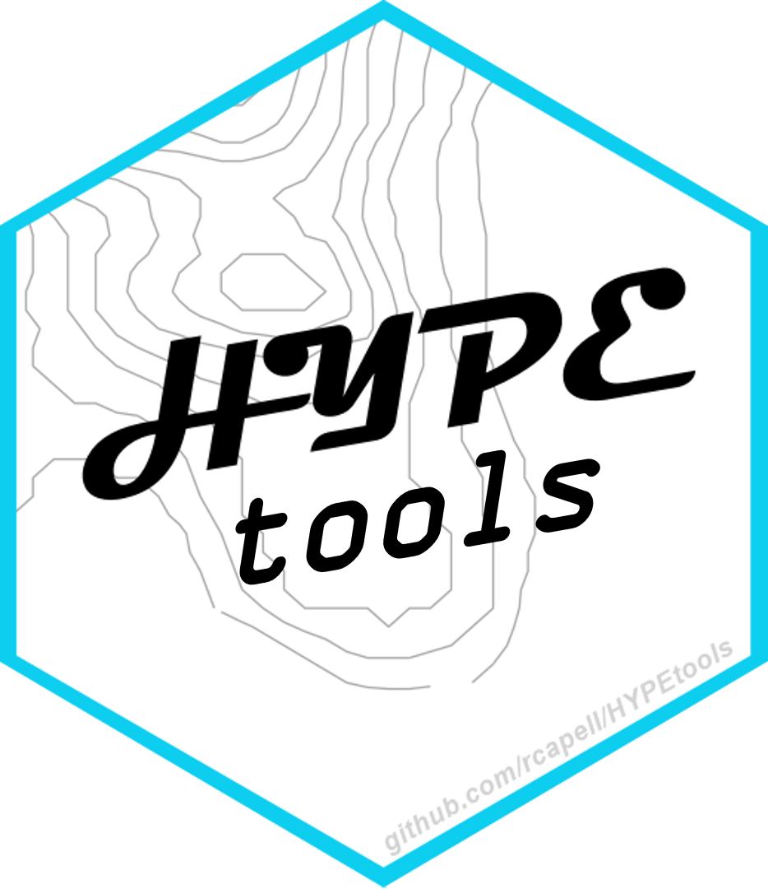

# HYPEtools <a href='https://github.com/rcapell/HYPEtools'></a>

<!-- badges: start -->
[](https://CRAN.R-project.org/package=HYPEtools)
[](https://anaconda.org/conda-forge/r-hypetools)
[](https://github.com/rcapell/HYPEtools/actions/workflows/R-CMD-check.yaml)
[](https://www.gnu.org/licenses/lgpl-3.0)
[](https://doi.org/10.5281/zenodo.7627955)
<!-- badges: end -->

## Summary

`HYPEtools` provides functions to work with the hydrological model [HYPE](https://hypeweb.smhi.se/model-water/). HYPE and `HYPEtools` are projects developed by the [Swedish Meteorological and Hydrological Institute (SMHI)](https://www.smhi.se/en).

## License

`HYPEtools` is licensed under the [LGPL-3.0](https://www.gnu.org/licenses/lgpl-3.0) license.

## Changelog

See the `HYPEtools` changelog [here](NEWS.md).

## Installation

`HYPEtools` is on CRAN and can be downloaded with:

```{r}
install.packages("HYPEtools")
```

If, however, you would like to install the latest development version of `HYPEtools` from [GitHub](https://github.com/rcapell/HYPEtools), then you can do so with:

```{r}
# install.packages("devtools")
devtools::install_github("rcapell/HYPEtools") # Install Without Vignettes
devtools::install_github("rcapell/HYPEtools", build_vignettes = T) # Install With Vignettes
```

More detailed instructions on installing the provided sources or package in R can be found [here](https://github.com/rcapell/HYPEtools/wiki/Install-and-Update-HYPEtools-from-github).

## Vignettes

Browse `HYPEtools` Vignettes with:

```{r}
browseVignettes("HYPEtools")
```

## Citation

### Publication
To cite `HYPEtools` in publications, please use the following publication reference:
> Brendel, C., R. Capell, and A. Bartosova. (2024) Rational gaze: Presenting the open-source HYPEtools R package for analysis, visualization, and interpretation of hydrological models and datasets. Environmental Modelling & Software, 178, 106094. https://doi.org/10.1016/j.envsoft.2024.106094

### Software
The `HYPEtools` software itself can also be cited in publications using the output from running the following in R:
```{r}
citation("HYPEtools")
```
